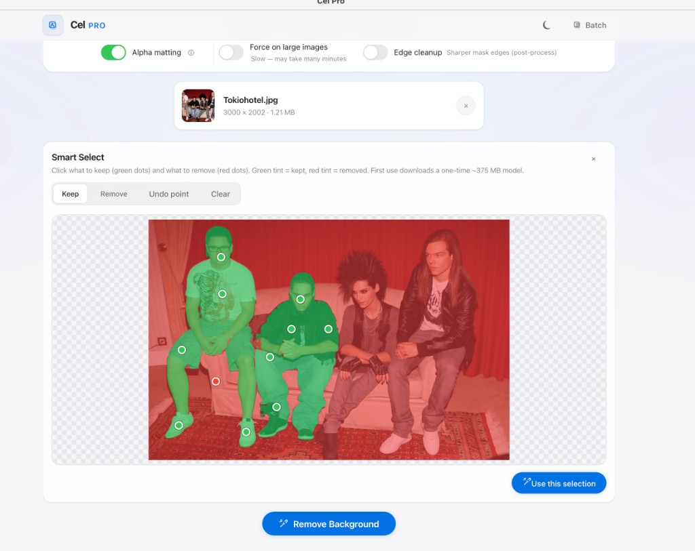
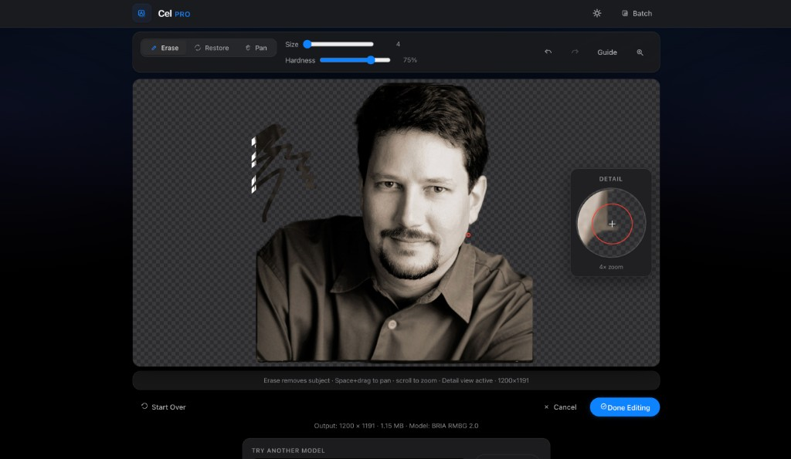

<p align="center">
  
</p>

<h1 align="center">Cel Pro</h1>

<p align="center">
  <strong>Local background removal + precision mask editing for macOS</strong><br>
  Drop a photo · refine the cutout · save a transparent PNG · nothing leaves your Mac
</p>

<p align="center">
  <a href="https://github.com/MRJOHN5ON/cel-android">Android version</a>
  ·
  
  
</p>

---

## Get Cel Pro on your Mac

There is no pre-built download yet — you build the app once on your Mac (~5–15 minutes the first time, mostly model downloads). After that, Cel Pro runs fully offline.

**You need:**

- macOS 12+ (Apple Silicon recommended)
- [Python 3.10+](https://www.python.org/downloads/macos/) from **python.org** (not Xcode Command Line Tools alone)
- Node.js 18+ (only for the build step)

### 1. Install Python

Download and run the installer from [python.org/downloads/macos](https://www.python.org/downloads/macos/). Then confirm:

```bash
python3 --version   # should show 3.10 or newer
```

### 2. Build the app

```bash
git clone https://github.com/MRJOHN5ON/cel.git
cd cel
chmod +x scripts/build_mac_app.sh
./scripts/build_mac_app.sh
cp -R "dist/Cel Pro.app" /Applications/
```

First build downloads ~1.5 GB of ML models into `packaging/models_cache/` (cached for future builds).

### 3. Install Python packages (one time)

Double-click **`dist/Install Cel Pro.command`**, or run:

```bash
./scripts/setup_cel_pro_deps.sh
```

This installs rembg, FastAPI, and other runtime deps into `~/Library/Application Support/Cel Pro/venv` (~few hundred MB, needs internet once).

### 4. Open Cel Pro

Launch from Applications. The first time, right-click → **Open** (the app is unsigned). If setup was skipped, Cel Pro will prompt you to run the installer script.

Logs: `~/Library/Logs/Cel Pro/cel-pro.log`

---

## If the build fails

**`SSL: CERTIFICATE_VERIFY_FAILED` while downloading models**

Fresh python.org installs on macOS often lack SSL root certificates. The build stops before `dist/Cel Pro.app` exists.

Fix (pick one):

1. **Easiest:** rerun `./scripts/build_mac_app.sh` — the download script retries with **curl** (uses macOS system certificates) when Python SSL fails.
2. **Permanent fix:** Finder → **Applications** → **Python 3.x** → double-click **`Install Certificates.command`**, then rebuild.
3. **Manual download** — see [scripts/download_models.py](scripts/download_models.py) for URLs, place files in `packaging/models_cache/`, then rerun the build.

**`cp: dist/Cel Pro.app: No such file or directory`**

The build did not finish. Scroll up in Terminal for the first error (usually model download), fix it, then rerun `./scripts/build_mac_app.sh`.

**App won't open / "damaged" warning**

Right-click **Cel Pro.app** → **Open** the first time. This is normal for unsigned local builds.

---

## What Cel Pro does

**Cel Pro** removes backgrounds from photos entirely on your Mac — no cloud APIs, no credits. Drag in a portrait, product shot, or batch of images. Powered by [rembg](https://github.com/danielgatis/rembg) running locally.

| Feature | Description |
|---------|-------------|
| **Background removal** | BRIA RMBG 2.0 (default), ISNet, U2Net — switch models from the dropdown |
| **Smart Select** | Click what to keep/remove before processing; live green/red overlay |
| **Mask editor** | Erase/restore brushes, undo/redo, 4× detail magnifier, pan & zoom |
| **Batch mode** | Process multiple images, download a ZIP |
| **Dark mode** | Matches your preference |

<p align="center">
  
</p>

<p align="center">
  
</p>

<p align="center">
  
</p>

### How to use

1. Drop a photo (JPG, PNG, WEBP, HEIC) or paste from clipboard
2. *(Optional)* **Smart Select** — click keep/remove points
3. Pick a model and click **Remove Background**
4. *(Optional)* **Edit Mask** to fine-tune edges
5. **Save Result** — transparent PNG via the macOS save panel

**Also on Android:** [Cel for Android](https://github.com/MRJOHN5ON/cel-android)

---

## Dev mode

Try changes without building the `.app`:

```bash
git clone https://github.com/MRJOHN5ON/cel.git
cd cel
chmod +x start.sh
./start.sh
```

Open **http://127.0.0.1:5173**. Dev mode uses a local `venv/` in the repo (separate from the Application Support venv used by the `.app`).

Pre-fetch all models: `python scripts/download_models.py` (~1.5 GB).

---

## Models

| Model | Best for | Size |
|-------|----------|------|
| **BRIA RMBG 2.0** *(default)* | Maximum quality | ~1 GB |
| **ISNet General** | People, hair, fine edges | ~170 MB |
| **U2Net Human** | Full-body portraits | ~168 MB |
| **U2Net** | Objects, products | ~168 MB |

BRIA RMBG 2.0 is [non-commercial only](THIRD_PARTY_NOTICES.md).

---

## Project layout

```
cel/
├── backend/          FastAPI + rembg
├── frontend-pro/     Cel Pro UI
├── packaging-pro/    Cel Pro.app launcher
├── scripts/          build_mac_app.sh, setup_cel_pro_deps.sh, download_models.py
└── start.sh          Dev mode
```

Legacy classic UI (no mask editor) is still in `frontend/` and `start-classic.sh` for reference.

---

## License

MIT — see [LICENSE](LICENSE). Third-party libraries and ML models: [THIRD_PARTY_NOTICES.md](THIRD_PARTY_NOTICES.md).
