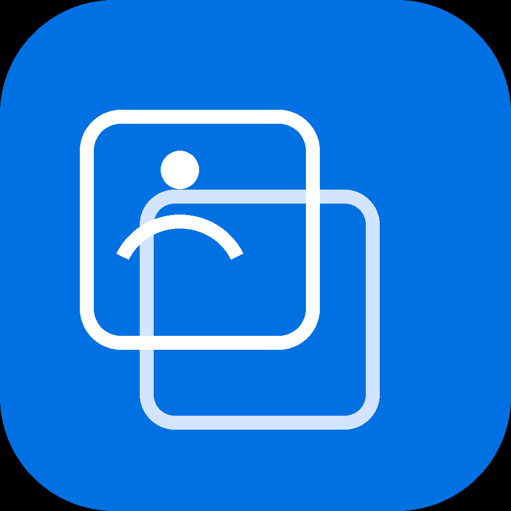
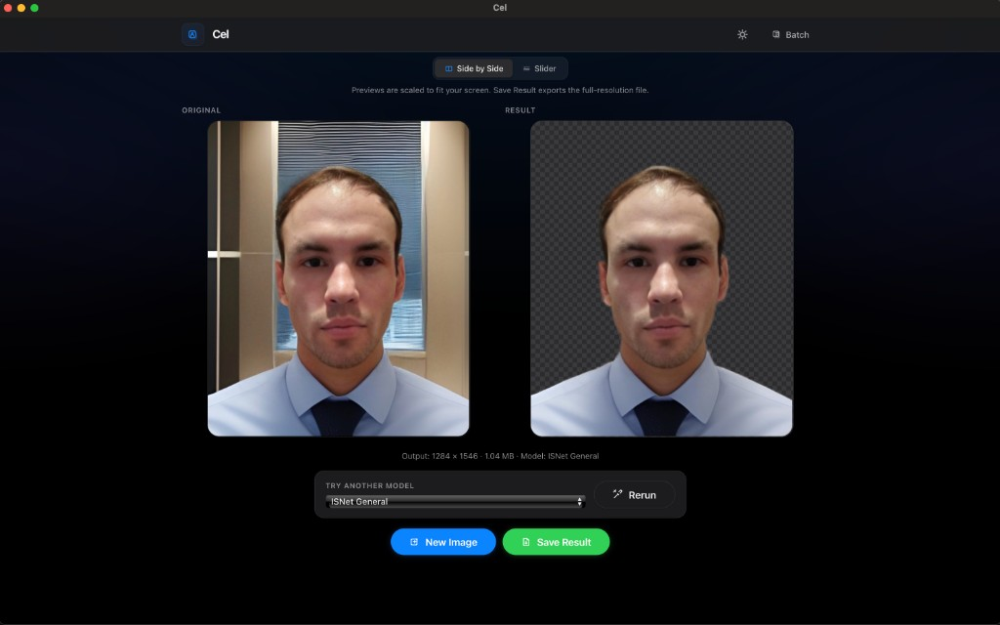
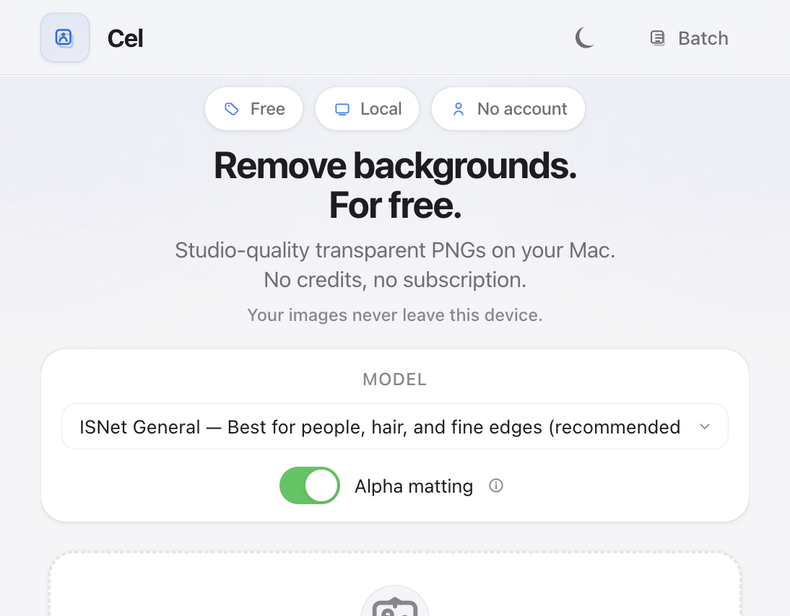
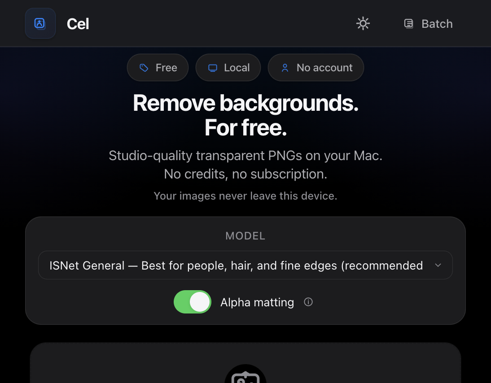

<p align="center">
  
</p>

<h1 align="center">Cel</h1>

<p align="center">
  <strong>Local background removal for macOS</strong><br>
  Drop a photo · get a transparent PNG · nothing leaves your Mac
</p>

<p align="center">
  
  
  
  
  
</p>

---

## What it is

Cel removes backgrounds from photos **entirely on your Mac** — no cloud APIs, no credits, no subscription. Drag in a portrait, product shot, or batch of images and save full-resolution transparent PNGs.

Named after the animation **cel** — a transparent layer with your subject on it. Powered by [rembg](https://github.com/danielgatis/rembg) running locally.

**No pre-built downloads.** Clone the repo and run from source or build `Cel.app` yourself on your Mac. Public releases may come later once the app is signed and notarized.

## Examples

<p align="center">
  
</p>

<p align="center">
  <em>Portrait · ISNet General · alpha matting on</em>
</p>

<p align="center">
  
</p>

<p align="center">
  
</p>

## Quick start (dev mode)

```bash
git clone https://github.com/MRJOHN5ON/cel.git
cd cel
chmod +x start.sh
./start.sh
```

Then open **http://127.0.0.1:5173**.

First run downloads the **isnet-general-use** model (~179 MB). After that, dev mode works fully offline.

### Requirements

- macOS 12+ (Apple Silicon for the bundled app build)
- Python 3.10+
- Node.js 18+ (frontend dev server only)

## How to use

1. **Drop a photo** — drag & drop, click to browse, or paste from clipboard (JPG, PNG, WEBP, HEIC)
2. **Pick your model** — ISNet General is the default and best for people, hair, and fine edges
3. **Remove Background** — wait for the progress bar (large images can take a minute or two)
4. **Preview** — compare side-by-side or with the slider
5. **Save Result** — exports a full-resolution transparent PNG via the macOS save panel

**Batch mode:** click **Batch** in the header to process multiple images and download a ZIP.

## Tips & tricks

- **Portraits & hair** — keep **ISNet General** + **Alpha matting** on (defaults). That's the sweet spot for people.
- **Large images** — alpha matting auto-turns off above ~2.5 MP to save time. You'll see a warning; you can force it on if you need wispy edge detail and don't mind waiting.
- **Try another model** — from the results screen, switch to **U2Net Human** for full-body portraits or **U2Net** for objects/products, then rerun.
- **Paste from clipboard** — copy an image anywhere, then paste (Cmd+V) into Cel. Handy for screenshots.
- **Dark mode** — toggle in the header; Cel remembers your choice.
- **Low-res warning** — if the source looks tiny or heavily compressed, Cel flags it before you waste time on a bad export.

## Build Cel.app (local only)

Build a self-contained native app on **your** Mac:

```bash
chmod +x scripts/build_mac_app.sh
./scripts/build_mac_app.sh
```

Output: `dist/Cel.app` — native window, bundled Python + UI + all models (~3 GB with BRIA).

- Built for the chip type of the machine you build on (`arm64` = Apple Silicon)
- Requires [python.org](https://www.python.org/downloads/macos/) Python 3.10 installed on the build machine
- **Unsigned** — fine for personal use on the Mac you built it on; distributing to others needs Apple Developer signing + notarization ($99/year)

Logs: `~/Library/Logs/Cel/cel.log`

## Project structure

```
├── backend/          # FastAPI + rembg
├── frontend/         # React + Vite
├── packaging/        # Cel.app launcher & native bridges
├── scripts/          # build_mac_app.sh, download_models.py
└── start.sh
```

## API

| Endpoint | Description |
|----------|-------------|
| `GET /api/health` | Server status |
| `GET /api/config` | App limits |
| `GET /api/models` | Available rembg models |
| `POST /api/inspect` | Image metadata |
| `POST /api/remove` | Process → PNG bytes |
| `POST /api/remove/job` | Async job with progress |
| `POST /api/batch` | Multi-image → ZIP |

## Options reference

| Option | Default | Notes |
|--------|---------|-------|
| Model | `isnet-general-use` | Also: `u2net`, `u2net_human_seg`, `bria-rmbg` (~1 GB, non-commercial) |
| Alpha matting | On | Auto-skipped above ~2.5 MP unless forced |
| Force alpha matting | Off | Can take many minutes on large images |

## License

Cel is MIT licensed — see [LICENSE](LICENSE).

Third-party libraries and ML models are listed in [THIRD_PARTY_NOTICES.md](THIRD_PARTY_NOTICES.md).
