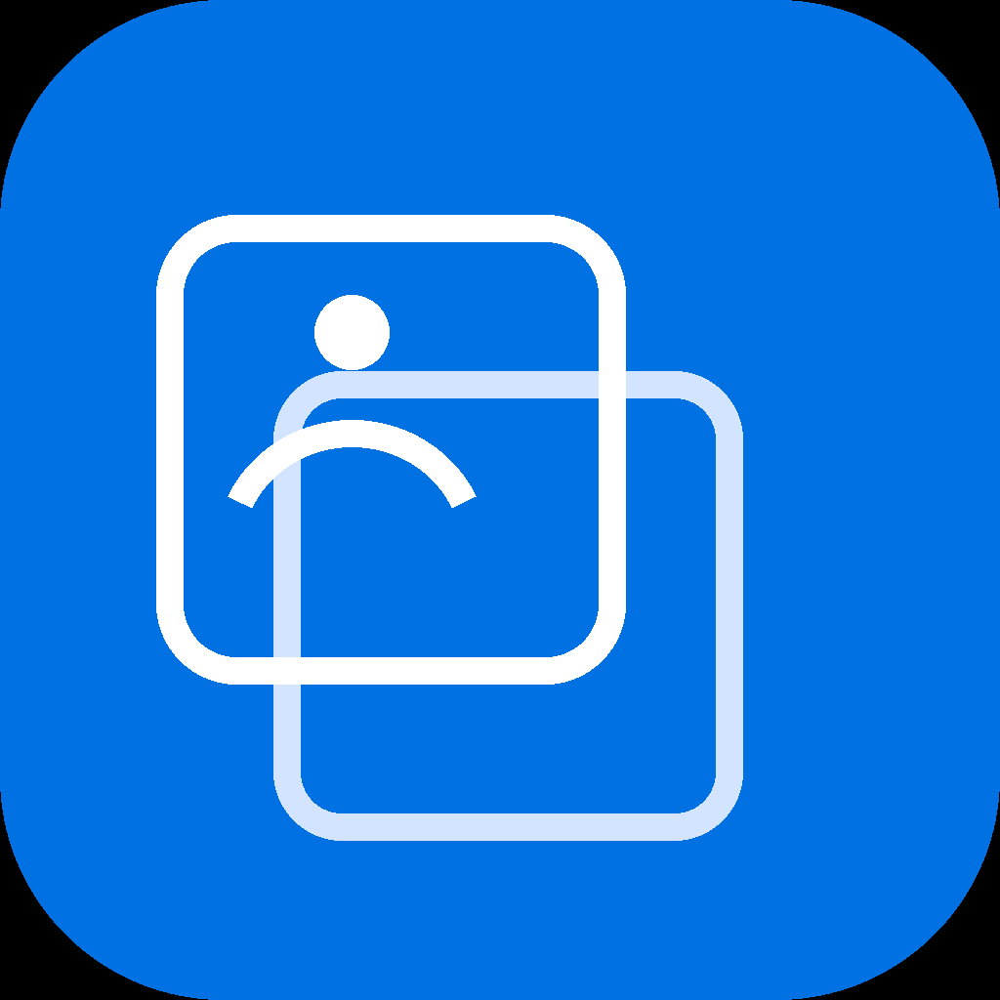
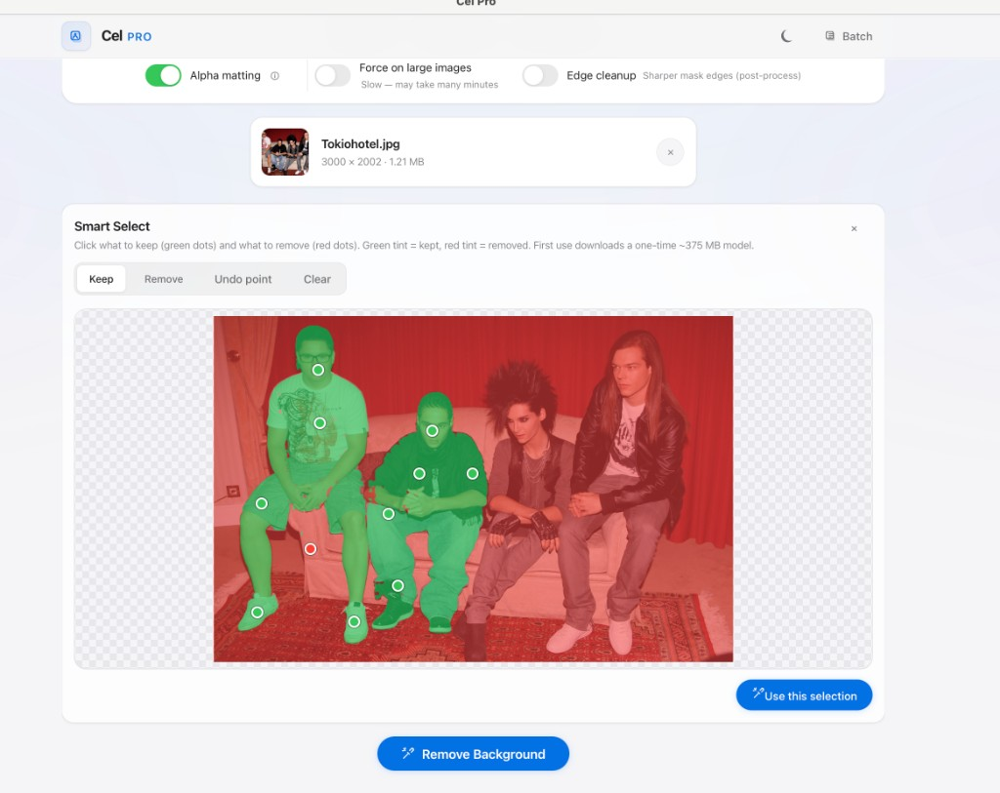
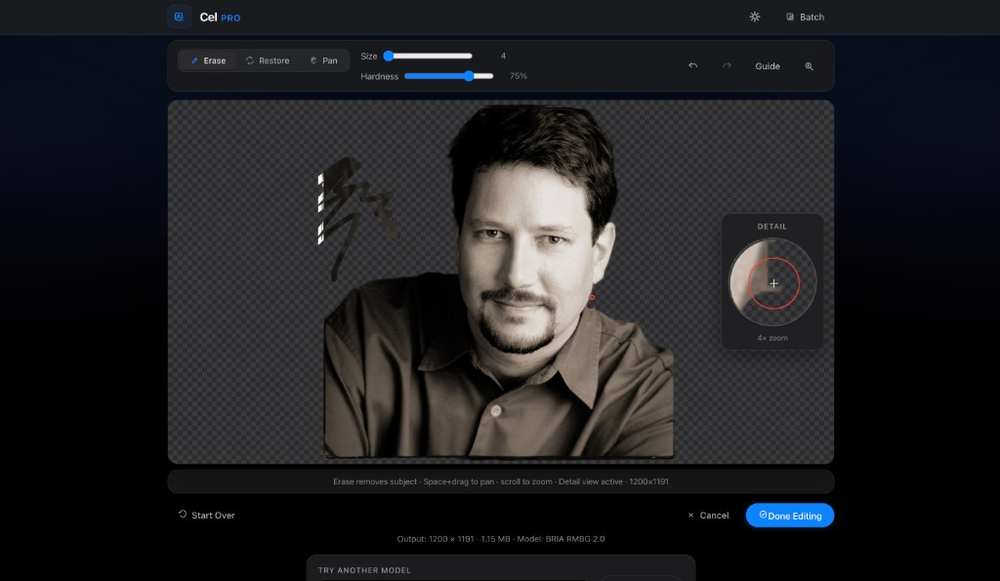
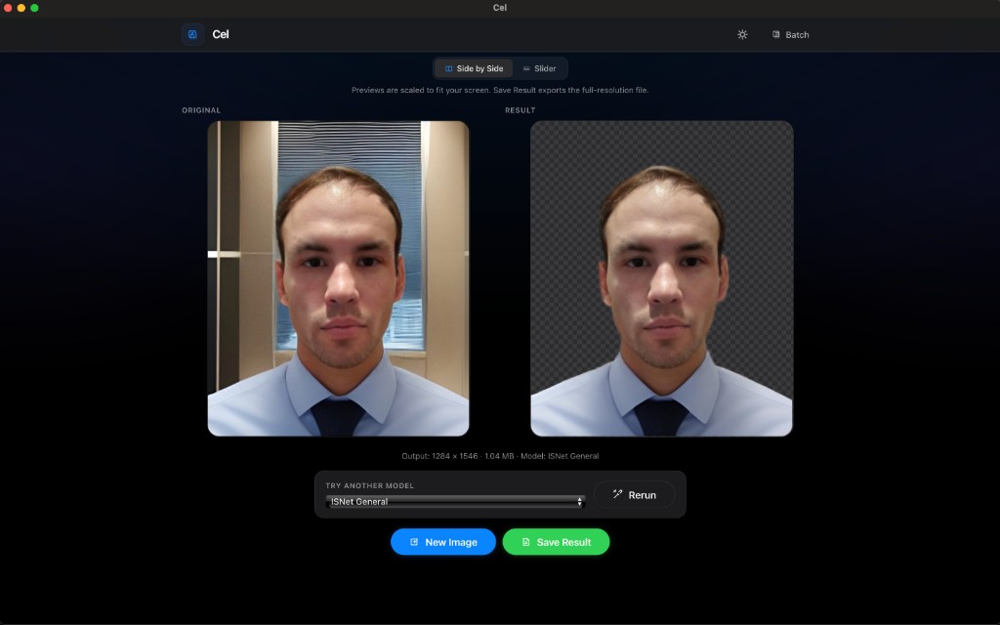

<p align="center">
  
</p>

<h1 align="center">Cel Pro</h1>

<p align="center">
  <strong>Local background removal + precision mask editing for macOS</strong><br>
  Drop a photo · refine the cutout · save a transparent PNG · nothing leaves your Mac
</p>

<p align="center">
  <a href="https://github.com/MRJOHN5ON/cel-android">Android version</a>
  ·
  
  
</p>

---

## Download

1. Download **Cel-Pro-…-arm64.dmg** from the [latest release](https://github.com/MRJOHN5ON/cel/releases/latest).
2. Open the DMG and drag **Cel Pro** into **Applications**.
3. Open Cel Pro. The first time, macOS says it can't verify the developer (the app isn't signed with a paid Apple Developer certificate). Go to **System Settings → Privacy & Security**, scroll down, click **Open Anyway** next to the Cel Pro message, and confirm. You only do this once.

**You need:** an Apple Silicon Mac (M1 or newer) on macOS 12.3 or later. Nothing else: Python and everything the app needs are inside it.

The first time you use **BRIA RMBG 2.0** (the default, best-quality model) Cel Pro downloads it once, about 1 GB, with progress shown in the app. The other three models are included, and after that everything works offline.

Logs: `~/Library/Logs/Cel Pro/cel-pro.log`

### Troubleshooting

**"Cel Pro is damaged and can't be opened"**: macOS sometimes says this about downloaded unsigned apps. Run this once in Terminal, then open the app again:

```bash
xattr -dr com.apple.quarantine "/Applications/Cel Pro.app"
```

**The BRIA download fails**: check your internet connection and press **Remove Background** again, or pick another model from the dropdown in the meantime. Partial downloads are discarded, never used.

**Intel Mac**: the download is Apple Silicon only. Use [Dev mode](#dev-mode) instead.

---

## Build the app yourself

```bash
git clone https://github.com/MRJOHN5ON/cel.git
cd cel
scripts/build_release.sh 1.2.0
```

Needs an Apple Silicon Mac with [uv](https://docs.astral.sh/uv/getting-started/installation/), Node.js 18+, and the Xcode Command Line Tools (`xcode-select --install`). The script fetches its own Python, downloads the bundled models once (~530 MB, cached in `packaging/models_cache/`), and writes `dist/release/Cel-Pro-1.2.0-arm64.dmg`.

Publishing a release: push a tag like `v1.2.0` and the [Release workflow](.github/workflows/release.yml) builds the DMG on GitHub and attaches it to a draft release. Review the draft, then publish it. Or build locally and run `scripts/build_release.sh 1.2.0 --publish`.

---

## What Cel Pro does

**Cel Pro** removes backgrounds from photos entirely on your Mac — no cloud APIs, no credits. Drag in a portrait, product shot, or batch of images. Powered by [rembg](https://github.com/danielgatis/rembg) running locally.

| Feature | Description |
|---------|-------------|
| **Background removal** | BRIA RMBG 2.0 (default), ISNet, U2Net — switch models from the dropdown |
| **Smart Select** | Click what to keep/remove before processing; live green/red overlay |
| **Mask editor** | Erase/restore brushes, undo/redo, 4× detail magnifier, pan & zoom |
| **Batch mode** | Process multiple images, download a ZIP |
| **Dark mode** | Matches your preference |

<p align="center">
  
</p>

<p align="center">
  
</p>

<p align="center">
  
</p>

### How to use

1. Drop a photo (JPG, PNG, WEBP, HEIC) or paste from clipboard
2. *(Optional)* **Smart Select** — click keep/remove points
3. Pick a model and click **Remove Background**
4. *(Optional)* **Edit Mask** to fine-tune edges
5. **Save Result** — transparent PNG via the macOS save panel

**Also on Android:** [Cel for Android](https://github.com/MRJOHN5ON/cel-android)

---

## Dev mode

Try changes without building the `.app`:

```bash
git clone https://github.com/MRJOHN5ON/cel.git
cd cel
chmod +x start.sh
./start.sh
```

Open **http://127.0.0.1:5173**. Dev mode needs Python 3.10+ and uses a local `venv/` in the repo. Models download to `~/.u2net` on first use.

Run the tests:

```bash
venv/bin/python -m pip install -r backend/requirements-dev.txt
venv/bin/python -m pytest backend/tests
(cd frontend-pro && npm test)
```

---

## Models

| Model | Best for | Size |
|-------|----------|------|
| **BRIA RMBG 2.0** *(default)* | Maximum quality | ~1 GB |
| **ISNet General** | People, hair, fine edges | ~170 MB |
| **U2Net Human** | Full-body portraits | ~168 MB |
| **U2Net** | Objects, products | ~168 MB |

BRIA RMBG 2.0 is [non-commercial only](THIRD_PARTY_NOTICES.md).

---

## Project layout

```
cel/
├── backend/          FastAPI + rembg
├── frontend-pro/     Cel Pro UI
├── packaging-pro/    Cel Pro.app launcher + PyInstaller spec
├── scripts/          build_release.sh, download_models.py
└── start.sh          Dev mode
```

Legacy classic UI (no mask editor) is still in `frontend/` and `start-classic.sh` for reference.

---

## License

MIT — see [LICENSE](LICENSE). Third-party libraries and ML models: [THIRD_PARTY_NOTICES.md](THIRD_PARTY_NOTICES.md).
